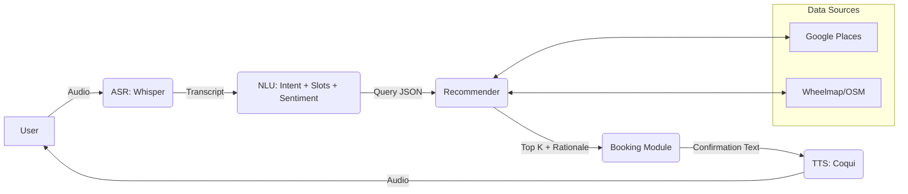

# Architecture Overview

```mermaid
flowchart LR
  A[User] -->|Audio| B(ASR: Whisper)
  B -->|Transcript| C(NLU: Intent + Slots + Sentiment)
  C -->|Query JSON| D(Recommender)
  D -->|Top K + Rationale| E(Booking Module)
  E -->|Confirmation Text| F(TTS: Coqui)
  F -->|Audio| A

subgraph Data Sources
  G[Google Places]
  H[Wheelmap/OSM]
end
D <---> G
D <---> H

classDef optional stroke-dasharray: 5 5
```
